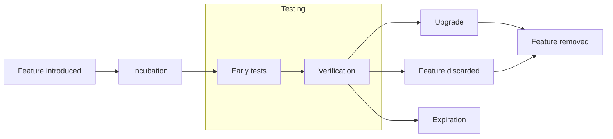

# Auderis Pennant
Advanced feature flags for Java

---

## Overview

Auderis Pennant is an advanced feature flag library for Java. Its primary
goals are:
- proactively guard against increase of a technical debt;
- offer an easy-to-use API that prevents introduction of a cluttered, unmaintainable code;
- allow management of individual feature flags during runtime;
- provide self-documenting tools;
- simplify workload in a testing phase.


### Project structure

The project consists of three parts:
- _Pennant API_ is a small library that contains Java annotations. This library
  is used by a developer to annotate the production code where a need for
  a new feature is identified.
- _Pennant Build Support_ is a Gradle plugin that addresses build-time tasks,
  among them instrumentation of the production code, maintenance of a feature flag
  catalog, generation of feature flag documentation, etc.
- _Pennant Runtime_ is a module that (along with the instrumented production code)
  provides the actual feature flag functionality and offers a management interface.
- _Pennant JUnit_ facilitates the management of feature flags within unit tests.

### Goals

__Proactive technical debt management__ is addressed by a concept of limited
feature flag lifetime. As soon as a feature flag is introduced, it is recorded
in a feature flag catalog along with its expiration date. The build process
then ensures that expired feature flags will cause build failure, forcing
a developer to perform an appropriate refactoring.

__Easy-to-use API__ is offered as a set of Java annotations that are designed
to minimize the clutter that is a typical result of feature flagging. Instead
of littering the production code with `if-else` statements, the switching logic
is provided by a build-time instrumentation. The developer can then focus on
developing the actual feature while keeping the original code around, until
the incubating feature is upgraded to a production-ready state. At that point
the original code, along with feature flag annotations, can be removed.

__Runtime management__ is represented by JMX interface that allows to query
the current state of all feature flags and to change the state of feature flags
that allow it.

__Self-documenting tools__ take advantage of the feature flag annotations
and compile a document that describes each feature flag in detail. This allows
to maintain an awareness of the current set of feature flags, their purpose
and their lifecycle stage.

__Testing tasks__ are simplified by the runtime, which can generate a usage
overview report of all feature flags. Testers can therefore determine which
feature combination is being tested, avoiding increased workload resulting
from configuration mistakes.


## Concepts

A _feature flag_ is a technique that allows two variants of code to coexist
in the codebase. For general introduction, see [Feature Toggles](https://martinfowler.com/articles/feature-toggles.html) by Pete Hodgson or
[Principles of Feature Flags](https://www.atlassian.com/continuous-delivery/principles/feature-flags) by Ian Buchanan.

Within the Auderis Pennant framework, a feature flag is a __named
boolean value__, i.e. it is a unique identifier associated with either
`false` or `true` value. As a convention, `false` represents the original state
of code while `true` denotes the incubating feature.


### Feature flag lifecycle

A lifetime of a feature flag starts with its introduction into the codebase and
ends with its removal. This lifetime is divided into several stages:



1. __Introduction__ means that a need for a specific feature was identified.
   A developer uses _Auderis Pennant API_ to distinguish the original code
   and the new implementation. The build system will detect the new feature
   flag and will add it to a feature flag catalog, recording its name and
   expected expiration date.
2. __Incubation__ is a development stage where the feature is incomplete. A developer
   will continue implementing it, enabling the feature flag for testing as needed.
3. __Early tests__ is a first stage where the feature may be enabled in a testing
   environment. The feature flag is disabled by default, the QA team will need
   to explicitly enable it for evaluation.
4. __Verification__ marks the transition from a testing to a production environment.
   The feature flag is now enabled by default, but the QA team can still disable it
   if needed. The feature flag is expected to be enabled for a longer period
   of time, so the QA team will need to periodically verify that the feature
   is still working as expected.
5.
    1. A decision to __Upgrade__  signals the end of the feature flag lifetime.
       Based on the results of previous stages, the feature flag is deemed
       ready for full production use, without a need for a fallback.
    2. In some cases, the verification phase results in a decision to __Discard__
       the feature. 
6. Ultimately, the feature flag is __Removed__ from the codebase, along with
   the code variant that is no longer needed (typically the legacy code in case
   of feature upgrade).
7. The build tools keep track of all feature flags. When a feature flag expires,
   the codebase can no longer be built. This ensures that the technical debt
   associated with the feature (e.g. multiple variants of the code) is not
   forgotten and is addressed in a timely manner.


## License

Auderis Pennant is licesed under the Mozilla Public License, version 2.0. See the
[LICENSE](LICENSE) file for details.

```
This Source Code Form is subject to the terms of the Mozilla Public
License, v. 2.0. If a copy of the MPL was not distributed with this
file, You can obtain one at https://mozilla.org/MPL/2.0/.
```

## Author

Boleslav Bobčík